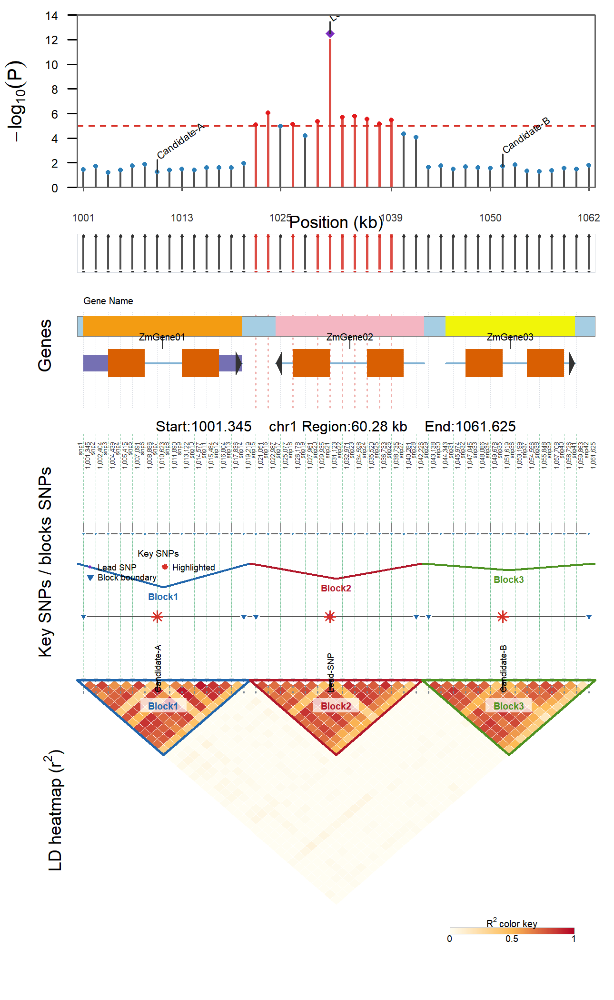

# LDblockR

`LDblockR` is an installable R package for regional linkage disequilibrium (LD) analysis and visualization. It covers the main workflow of LDBlockShow while adding HapMap input, subpopulation comparisons, LD decay, haplotype frequency estimation, batch region processing, a pure R API, and automatic large-matrix rasterization.

The current submitted version is **0.0.1**. The canonical project repository, source code, and issue tracking are hosted on Gitee:
<https://gitee.com/anhuikylin/LDblockR>.

A public GitHub mirror is also available for code browsing and collaboration:
<https://github.com/anhuikylin/LDblockR>.

The package depends only on R's recommended components and does not require `ggplot2`, Bioconductor, or Java. Plain VCF/VCF.GZ files can be read directly; when `bcftools` is installed, indexed VCF region extraction is automatically accelerated.

## Main Features

| Feature | LDblockR |
|---|---|
| VCF / VCF.GZ | Supported, built-in streaming reader; automatic bcftools invocation |
| HapMap | Supported, suitable for maize population data |
| PLINK BED/BIM/FAM | Native reading |
| PLINK PED/MAP | Native reading |
| Numerical genotype matrix | Supports 0/1/2/NA |
| Subpopulation analysis | Supports arbitrary sample groups and between-group LD differences |
| LD metrics | Automatic selection of dosage or phased-haplotype \(r^2\), EM-estimated \(D'\) |
| Block detection | Gabriel, solid spine, strong-pair, four-gamete, fixed interval, no block |
| tagSNP selection | Greedy minimum-cover selection |
| Joint tracks | GWAS, GFF3/GTF, block, tagSNP, specified SNP; optional MAF track |
| Large plots | Automatic switching between vector/raster heatmaps; statistical results never subsampled |
| Graphics | Manhattan, Q-Q, regional LD; PDF, SVG, PNG, TIFF |
| Tables | Sites, pairwise LD, blocks, tags, and LDBlockShow-style files |
| Extended analysis | LD decay, haplotype frequencies, neighboring SNPs, batch regions |
| Usage modes | R functions, one-click pipeline, command line |

## Installation

```r
# Preferred source (Gitee)
pak::pak("git::https://gitee.com/anhuikylin/LDblockR.git")

# Public GitHub mirror
# pak::pak("git::https://github.com/anhuikylin/LDblockR.git")

library(LDblockR)
packageVersion("LDblockR")  # 0.0.1
```

The package is a pure R source package and can be installed on Linux, macOS, and Windows without a compiler.

You can obtain the source code from either repository and build locally. The Gitee repository is the canonical source; the GitHub repository is a public mirror:

```bash
# Gitee
git clone https://gitee.com/anhuikylin/LDblockR.git
# Alternatively, clone the GitHub mirror:
# git clone https://github.com/anhuikylin/LDblockR.git

R CMD build LDblockR
R CMD INSTALL LDblockR_0.0.1.tar.gz
```

When developing with RStudio, unzip `LDblockR_0.0.1_source.zip` and double-click `LDblockR/LDblockR.Rproj`. The standard `.tar.gz` installation package excludes the `.Rproj` file per R package conventions.

## 30-Second Run of Built-in Example

```r
library(LDblockR)

regional <- example_data("regional")
stopifnot(all(file.exists(regional[names(regional) != "plink"])))
vcf <- regional[["vcf"]]
gwas <- regional[["regional_gwas"]]
gff <- regional[["gff3"]]

result <- ldblockr(
  input = vcf,
  output_prefix = "LDblockR_demo",
  region = "chr1:1000000-1100000",
  min_maf = 0.01,
  measure = "both",
  block_method = "gabriel",
  gwas = gwas,
  gff = gff,
  special = c(snp21 = "Lead SNP"),
  output_formats = c("pdf", "svg", "png")
)

result$blocks
result$tags
result$files
```

If `example_data("regional")` reports that the bundle is missing or incomplete, the current installation does not contain the package example files. Do not replace the missing files with invented filenames; reinstall the complete source package or provide real paths to your own VCF, GWAS, and annotation files.

## Direct Use of Built-in Regional GWAS

After installation of the complete source package, the built-in regional files can be obtained with `example_data("regional")`. The returned paths include the VCF, HapMap, GWAS tables, GFF3, sample lists, matrix/map files, PLINK prefix, and batch-region table.

```r
regional <- example_data("regional")
stopifnot(all(file.exists(regional[names(regional) != "plink"])))
gwas <- read_gwas(regional[["regional_gwas"]])

x <- read_vcf_region(regional[["vcf"]], region = "chr1:1000000-1100000",
                     min_maf = 0.01, quiet = TRUE)
ld <- ld_compute(x, measure = "r2", r2_method = "dosage")
blocks <- read.table(regional[["fixed_blocks"]], header = TRUE,
                     sep = "\t", stringsAsFactors = FALSE)
special <- read.table(regional[["special"]], header = TRUE,
                      sep = "\t", stringsAsFactors = FALSE)

p <- plot_ld(ld, metric = "r2", gwas = gwas,
              genes = regional[["gff3"]], blocks = blocks,
              special = special,
              cutline = 5, show_connectors = TRUE,
              show_snp_connectors = TRUE,
              heatmap_colors = c("#FFFDF2", "#FDBB55", "#B40426"),
              snp_label_type = "id_position", max_snp_labels = Inf,
              draw = FALSE)
save_ld_plot(p, "regional_LD.png", width = 4.3, height = 7, dpi = 300)
```




In this plot, the regional GWAS track is at the top, the SNP annotation track displays each LD marker's ID and physical position, and each SNP is connected to its corresponding Block/heatmap position via light green dashed lines (LDBlockShow style). The LD heatmap uses full-width coordinates consistent with the upper tracks, while the Block track remains immediately above the LD heatmap. Inside the LD heatmap, colored sub-triangle boundaries and labels such as `Block1`, `Block2` mark the blocks. By default, up to 120 SNPs are labeled; for dense regions, set `max_snp_labels = Inf` to force labeling of all SNPs, or use `snp_label_type = "id"`/`"position"` to show only IDs/positions, or disable the track with `show_snp_labels = FALSE`. To use your own files, replace `regional[["regional_gwas"]]` with a path that passes `file.exists()`.

## TASSEL Example Data and Mixed Linear Model GWAS

The built-in `mdp_genotype.hmp.txt`, `mdp_phenotype.txt`, `mdp_kinship.txt`, `mdp_population_structure.txt`, and `mdp_traits.txt` are original copies of the rTASSEL official tutorial data, not simulated by LDblockR. Their source, fixed commit hash, original download URLs, file sizes, and SHA-256 checksums are recorded in `extdata/tassel/SOURCE.md` and `PROVENANCE.json`. Use `example_data()` to view absolute paths after installation:

```r
paths <- example_data()
paths[["mdp_genotype"]]
paths[["mdp_phenotype"]]
```

The following workflow uses `EarHT` as the trait, retains replicate observations from two locations as independent observations, and includes `location` along with population structure `Q1--Q3` as fixed effects. The model in `gwas_mlm()` is

\[
y = X\beta + Zu + e, \qquad u \sim N(0, K\sigma_g^2),
\]

It first estimates the variance ratio \(\delta=\sigma_e^2/\sigma_g^2\) on the null model (no markers), then fixes that value for a GLS scan across all SNPs (P3D principle). Compared to per-SNP REML re-estimation, the computational cost is dominated by a single eigen-decomposition and BLAS matrix block operations; the implementation is independent of GAPIT. In the result table, `PVE` is the partial phenotypic variance explained by each SNP, and `model_PVE` is the variance component estimate from the null model.

```r
library(LDblockR)
paths <- example_data("tassel")
pheno <- read_tassel_phenotype(paths[["mdp_phenotype"]])

gwas <- gwas_mlm(
  genotype = paths[["mdp_genotype"]],
  phenotype = pheno,
  trait = "EarHT",
  covariates = c("location", "Q1", "Q2", "Q3"),
  replicate = "expand",   # retain replicate observations from locations A/B
  min_maf = 0.05,
  max_missing = 0.20,
  chunk_size = 256,
  verbose = TRUE
)

head(gwas[order(gwas$p), c("id", "chr", "pos", "p", "PVE", "model_PVE")])
attr(gwas, "model")$model_PVE
```

## Manhattan and Q-Q Plots

`plot_manhattan()` and `plot_qq()` accept results from `gwas_mlm()`, plain data frames, or GWAS TSV files directly. Both rely only on base R: the Manhattan plot uses concatenated chromosome coordinates and draws a Bonferroni threshold line by default; when a `PVE` column is present, point size can encode marker-level PVE. The Q-Q plot draws a 95% order-statistic confidence band and reports the genomic inflation factor `lambda`.

```r
cutline <- -log10(0.05 / nrow(gwas))
lead <- gwas$id[which.max(gwas$logp)]

manhattan <- plot_manhattan(
  gwas, cutline = cutline, color_by = "significance",
  point_size_by = "PVE", highlight = lead, label_top = 5,
  title = "Ear height mixed-model GWAS", draw = FALSE
)
qq <- plot_qq(gwas, highlight = lead,
              title = "Ear height mixed-model GWAS Q-Q plot", draw = FALSE
)

save_gwas_plot(manhattan, "Figure_EarHT_Manhattan.pdf", width = 8.5, height = 5.4)
save_gwas_plot(manhattan, "Figure_EarHT_Manhattan.png", width = 8.5, height = 5.4, dpi = 400)
save_gwas_plot(qq, "Figure_EarHT_QQ.pdf", width = 6.8, height = 6.2)
save_gwas_plot(qq, "Figure_EarHT_QQ.png", width = 6.8, height = 6.2, dpi = 400)
```

For `plot_manhattan()`, `color_by` can be `"chromosome"`, `"significance"`, or `"pve"`; set `point_size_by = "none"` to disable PVE point-size encoding. `plot_qq()` allows `confidence = 0.99` and `show_lambda = FALSE` to hide the lambda legend. Both plot types support `save_gwas_plot()` for SVG and TIFF output, suitable for manuscripts and supplementary materials.

`plot_manhattan()` also offers fine-grained control similar to CMplot. `chr_colors` can be a named vector per chromosome or an unnamed vector; with `color_cycle = TRUE`, colors are cycled; when `FALSE`, each chromosome requires a color. `threshold` and `suggestive` support multiple `-log10(P)` values, with `threshold_col`/`suggestive_col`, `threshold_lty`, and `threshold_lwd` adjustable per threshold. Parameters such as `chr_labels`, `gap_ratio`/`gap_bp`, `gap_mode`, `pch`, `signal_cex`, `alpha`, `ylim`/`xlim`, `show_grid`, and font settings are available for publication-ready layouts. By default, `gap_mode = "fixed"`, so the same gap is used between chromosomes; to specify a custom gap size, use `gap_bp` in the same units as `pos`. The x-axis width is scaled proportionally to each chromosome's maximum physical coordinate by default; supplying `chr_lengths` with reference genome chromosome lengths allows direct use of those lengths, while `width_mode = "observed"` reverts to marker-span layout and `width_mode = "equal"` forces equal widths.

```r
# Generate one named color and one label for every chromosome actually present in gwas.
# A 10-chromosome GWAS table cannot be plotted with only three labels or lengths.
chromosomes <- unique(as.character(gwas$chr))
chr_col <- setNames(grDevices::hcl.colors(length(chromosomes), palette = "Dark 3"),
                     chromosomes)
chr_labels <- setNames(
  ifelse(grepl("^chr", chromosomes, ignore.case = TRUE), chromosomes,
         paste0("Chr ", chromosomes)),
  chromosomes
)
m_named <- plot_manhattan(
  gwas, threshold = c(-log10(0.05 / nrow(gwas)), 4), suggestive = 2,
  chr_colors = chr_col, color_cycle = FALSE,
  chr_labels = chr_labels,
  color_significant = TRUE, point_size_by = "PVE", signal_cex = 1.35,
  pch = 16, alpha = 0.85, threshold_col = c("#D73027", "#762A83"),
  threshold_lty = c(2, 3), threshold_lwd = c(1.2, 0.9), draw = FALSE)

# Two-color cycling: suitable for genome-wide plots with many chromosomes
m_cycle <- plot_manhattan(gwas, chr_colors = c("#2C7FB8", "#7B3294"),
                          color_cycle = TRUE, draw = FALSE)
save_gwas_plot(m_named, "Figure_EarHT_Manhattan_custom.pdf", width = 8.5, height = 5.4)
```

If you already have reference genome chromosome lengths, you can specify different widths explicitly:

```r
# Use the largest observed coordinate for every chromosome as a runnable example.
# These are not assembly chromosome lengths; replace them with a complete reference vector when available.
chromosomes <- unique(as.character(gwas$chr))
chr_lengths <- tapply(gwas$pos, as.character(gwas$chr), max, na.rm = TRUE)
chr_lengths <- chr_lengths[chromosomes]
m_length <- plot_manhattan(
  gwas, chr_lengths = chr_lengths, width_mode = "length",
  chr_colors = chr_col,
  color_cycle = FALSE, gap_bp = 5000000, draw = FALSE
)
```

For a reference-genome layout, `chr_lengths` must define every chromosome in `gwas$chr`, preferably as a named vector followed by `chr_lengths[chromosomes]`. If you only want chromosomes 1--3, subset `gwas` first and then supply three corresponding colors, labels, and lengths; do not pass three values to a table containing ten chromosomes.

In legacy code, `cutline` and `palette` still work; when `threshold` is supplied, it overrides `cutline`. If using unnamed colors with cycling disabled, the function will error when the number of colors is fewer than the number of chromosomes, preventing color mismatches in publication figures.

If you wish to keep only one observation per taxa, set `replicate = "mean"`; if you have an independent TASSEL kinship matrix, pass `kinship = paths[["mdp_kinship"]]`. Kinship and HapMap samples are automatically intersected by Taxa ID, and the source is retained in the result metadata.

## Creating Publication-Quality Main Figures from GWAS Results

`plot_ld()` now uses a publication-ready layout by default: the top track shows regional `-log10(P)` association (significant points in red, others in blue, with point size encoding PVE and a PVE legend), followed by optional alignment connectors, gene models, and an MAF track, then an SNP ID/physical position annotation track, SNP-to-heatblock dashed connectors, and a Block track, with the triangular LD heatmap at the bottom displaying values, cell grids, tagSNP markers, Block sub-triangle annotations, and a continuous \(R^2\) color key. The lower heatmap omits the outer rectangular frame and overall triangle outline, retaining only colored local boundaries for block identification. Top-track points are shown only for SNPs that enter the LD matrix, using the same LD coordinate index; by default `show_connectors = TRUE`, so each point has a connecting line to the corresponding marker on the heatmap baseline. The SNP annotation track and heatmap share the same SNP index order; the heatmap top baseline retains short tick marks for each SNP, and light dashed lines transformed to device coordinates connect these directly to the heatmap top, making it easy to see which block each SNP belongs to. Set `show_snp_connectors = FALSE` to hide the dashed lines, or `show_snp_labels = FALSE` to hide the SNP annotation track entirely. Heatmap colors can be freely specified with `heatmap_colors` using 2 or more colors; this overrides `palette` and updates both the heatmap and the color key simultaneously—for example, `heatmap_colors = c("white", "skyblue", "navy")`. The MAF track is off by default and is only included when `show_maf = TRUE` is explicitly set.

For a direct "GWAS–Genes–MAF–Key SNPs–Blocks–LD heatmap" integrated regional view like the reference figure, use `plot_ld_region()`. It enables MAF, key SNP legend, and SNP-to-heatmap dashed guides by default, and colors regional GWAS points by \(r^2\) to the lead SNP; individual SNP labels or separate connectors can be enabled via parameters as needed.

```r
regional <- example_data("regional")
gwas_region <- read_gwas(regional[["regional_gwas"]])
x_region <- read_vcf_region(regional[["vcf"]],
                            region = "chr1:1000000-1100000",
                            min_maf = 0.01, quiet = TRUE)
ld_region <- ld_compute(x_region, measure = "r2", r2_method = "dosage")
blocks_region <- read.table(regional[["fixed_blocks"]], header = TRUE,
                            sep = "\t", stringsAsFactors = FALSE)
tags_region <- select_tag_snps(ld_region, threshold = 0.8)
cutline <- 5
p_region <- plot_ld_region(
  ld_region, gwas = gwas_region, genes = regional[["gff3"]],
  blocks = blocks_region, tags = tags_region, lead = "snp21",
  cutline = cutline, draw = FALSE
)
save_ld_plot(p_region, "Figure_integrated_regional_LD.pdf", width = 8.5, height = 8)
save_ld_plot(p_region, "Figure_integrated_regional_LD.png", width = 8.5, height = 8, dpi = 400)
```

The key SNP track uses purple diamonds for lead SNPs, orange circles for tag SNPs, blue triangles for block boundaries, and red stars for `special` variants; colors can be customized via `key_snp_colors`.

```r
# Use matching bundled regional GWAS and HapMap files in this runnable example.
# Do not combine regional_gwas.tsv with the unrelated TASSEL HapMap panel.
regional <- example_data("regional")
gwas <- read_gwas(regional[["regional_gwas"]])
cutline <- 5
region_info <- gwas_ld_region(gwas, cutline = cutline, flank = 250000,
                              min_width = 100000)
region <- region_info$region
lead <- region_info$lead_id
gwas_region <- region_info$selected

ld_data <- read_hapmap(regional[["hapmap"]], region = region,
                        min_maf = 0.05, max_missing = 0.20, quiet = TRUE)
ld <- ld_compute(ld_data, measure = "r2", r2_method = "dosage")

p <- plot_ld(ld, metric = "r2", gwas = gwas_region, lead = lead,
              cutline = cutline, show_connectors = TRUE,
              palette = "publication", show_values = TRUE,
              gwas_color_by = "significance", show_maf = FALSE,
              title = "Bundled regional GWAS and LD",
              draw = FALSE)
save_ld_plot(p, "Figure_LDblockR_regional.pdf", width = 8.5, height = 7.2)
save_ld_plot(p, "Figure_LDblockR_regional.svg", width = 8.5, height = 7.2)
```

The `gwas` argument can be the table returned by `gwas_mlm()`, or you can write it to TSV first and pass it to `plot_ld()`; `read_gwas()` preserves columns such as `PVE`, `beta`, and `se`. For small regions, `show_values = TRUE` is recommended; for large regions, lossless rasterization is used automatically to control file size.

The genotype panel and GWAS table must describe the same chromosome/position/marker set. `read_hapmap()`, `read_vcf_region()`, and `read_plink()` accept equivalent chromosome labels such as `1` and `chr1`, but they cannot create variants that are absent from the selected genotype file.

Regarding speed and memory, the null-model eigen-decomposition is a single \(O(n^3)\) operation, and marker scanning uses BLAS matrix block operations; `chunk_size` controls peak memory (approximately `n × chunk_size` numeric values), and there is no per-SNP REML re-optimization. Increasing `chunk_size` typically improves throughput; on memory-constrained systems, reduce to 64 or 128. The statistical model and PVE definition remain unchanged.

## Step-by-Step Usage

```r
regional <- example_data("regional")
stopifnot(all(file.exists(regional[names(regional) != "plink"])))
region <- "chr1:1000000-1100000"

x <- read_vcf_region(
  regional[["vcf"]],
  region = region,
  samples = regional[["subpopulation_A"]],
  min_maf = 0.05,
  max_missing = 0.25,
  max_het = 1,
  quiet = TRUE
)

ld <- ld_compute(
  x,
  measure = "both",
  max_distance = 1000000,
  ci = TRUE
)

blocks <- detect_ld_blocks(ld, method = "gabriel")
tags <- select_tag_snps(ld, threshold = 0.8, blocks = blocks)
gwas <- read_gwas(regional[["regional_gwas"]], region = region)
special <- read.table(regional[["special"]], header = TRUE, sep = "\t",
                      stringsAsFactors = FALSE)

p <- plot_ld(
  ld,
  metric = "both",
  gwas = gwas,
  genes = regional[["gff3"]],
  blocks = blocks,
  tags = tags,
  special = special,
  cutline = 5.7,
  palette = "classic",
  draw = FALSE
)

save_ld_plot(p, "regional_LD.pdf", width = 11, height = 9)
save_ld_plot(p, "regional_LD.svg", width = 11, height = 9)
save_ld_plot(p, "regional_LD.png", width = 11, height = 9, dpi = 400)
```

The code above uses only files distributed with the package. For a real analysis, replace these paths with files that exist on your computer; `read_vcf_region()`, `read_hapmap()`, and `read_plink()` do not create missing input files.

## HapMap, PLINK, and Matrix Input

```r
# Bundled HapMap example
regional <- example_data("regional")
x_hmp <- read_hapmap(
  regional[["hapmap"]], region = "chr1:1000000-1100000",
  samples = regional[["subpopulation_A"]],
  min_maf = 0.05, max_missing = 0.25, max_het = 1, quiet = TRUE
)

# Bundled PLINK BED/BIM/FAM example; the argument is the prefix without an extension.
plink_dir <- system.file("extdata", "plink", package = "LDblockR")
x_plink <- read_plink(file.path(plink_dir, "example_plink"),
                      min_maf = 0, max_missing = 1, quiet = TRUE)

# 0/1/2 matrix with samples in rows, SNPs in columns
snp_map <- read.table(regional[["map"]], header = TRUE, sep = "\t",
                      stringsAsFactors = FALSE)
x_matrix <- read_genotypes(regional[["matrix"]], format = "matrix", map = snp_map)
```

`snp_map` should contain at least a position column (`pos`/`position`/`bp`); `chr`, `id`, `ref`, and `alt` are recommended.

## Subpopulation Comparison

```r
regional <- example_data("regional")
groups <- read.table(regional[["sample_groups"]], header = TRUE, sep = "\t",
                     stringsAsFactors = FALSE)
# Read all 60 samples. If x was read with subpopulation_A.txt, it contains
# only one group and cannot be compared with Group_B.
x_groups <- read_vcf_region(
  regional[["vcf"]], region = "chr1:1000000-1100000",
  min_maf = 0.01, max_missing = 0.25, quiet = TRUE
)
group_ld <- ld_by_group(x_groups, groups, measure = "both")
delta_r2 <- ld_compare(group_ld, metric = "r2", reference = "Group_A")
```

## LD Decay and Haplotype Frequencies

```r
decay <- ld_decay(ld, metric = "r2", n_bins = 40)
plot_ld_decay(decay)

# A data-driven method can legitimately return zero blocks when its thresholds
# are not met. Never index blocks$snps[1] before checking nrow(blocks).
blocks_for_haplotype <- blocks
if (!nrow(blocks_for_haplotype)) {
  message("No Gabriel block was detected; using the bundled fixed intervals for this example.")
  fixed <- read.table(regional[["fixed_blocks"]], header = TRUE, sep = "\t",
                      stringsAsFactors = FALSE)
  blocks_for_haplotype <- detect_ld_blocks(ld, method = "fixed", fixed = fixed)
}
if (!nrow(blocks_for_haplotype)) {
  stop("No block is available for haplotype calculation; check the chromosome and coordinates.")
}

# Blocks store their SNP IDs as a | delimited string. Split it before passing
# the IDs to haplotype_frequencies(); a single block string is also accepted.
block_snps <- strsplit(blocks_for_haplotype$snps[1L], "|", fixed = TRUE)[[1L]]
hap <- haplotype_frequencies(x, variants = block_snps)
```

## Batch Regions

```r
regional <- example_data("regional")
regions <- read.table(regional[["regions"]], header = TRUE, sep = "\t",
                      stringsAsFactors = FALSE)

batch <- ld_batch(
  regional[["vcf"]],
  regions,
  output_dir = "LD_regions",
  measure = "both",
  block_method = "strong",
  output_formats = "pdf"
)
```

## Command Line

After installing the package, locate the command-line script:

```r
system.file("exec", "LDblockR", package = "LDblockR")
```

The following command runs from the repository root after the package has been installed and uses only files shipped in `inst/extdata/`:

```bash
LDblockR --vcf inst/extdata/example.vcf.gz \
  --out LDblockR_demo_cli \
  --region chr1:1000000-1100000 \
  --samples inst/extdata/subpopulation_A.txt \
  --gwas inst/extdata/regional_gwas.tsv \
  --gff inst/extdata/example.gff3 \
  --measure both \
  --block-method gabriel \
  --formats pdf,svg,png
```

It also accepts common LDBlockShow parameter aliases. This equivalent command uses the same bundled files:

```bash
LDblockR -InVCF inst/extdata/example.vcf.gz -OutPut LDblockR_demo_alias \
  -Region chr1:1000000-1100000 -SubPop inst/extdata/subpopulation_A.txt \
  -SeleVar 4 -BlockType 1 -InGWAS inst/extdata/regional_gwas.tsv \
  -InGFF inst/extdata/example.gff3 \
  -OutPdf -OutPng
```

## Reproducibility and Figure 2

The repository includes the input files and archived reference outputs required to reproduce the numerical validation and manuscript figures. The regional synthetic bundle is stored in `inst/extdata/`, including `example.vcf.gz`, `example.hmp.txt`, `example_matrix.tsv`, `example_map.tsv`, `regional_gwas.tsv`, `example.gff3`, `example_fixed_blocks.tsv`, `example_special.tsv`, `subpopulation_A.txt`, `subpopulation_B.txt`, and `example_regions.tsv`. The PLINK examples are in `inst/extdata/plink/`. The archived pairwise reference table is `inst/extdata/reference/synthetic_reference_pairs.tsv`, and the externally generated LDBlockShow 1.41 outputs are in `inst/extdata/reference/ldblockshow/`.

Figure 2 combines two explicitly documented sources. The regional demonstration uses the bundled synthetic genotype/GWAS/annotation files in `inst/extdata/`; these files are supplied for reproducible plotting and are not an external population dataset. The numerical validation compares 861 phased synthetic SNP pairs with the archived LDBlockShow 1.41 reference output. The official rTASSEL maize tutorial files are used separately for the maize QC and regional-analysis example. Thus, no missing file such as `population.vcf.gz` or `maize507.hmp.txt.gz` is required. The reproduction script performs the input-consistency checks, pairwise comparison, archived-output check, and maize analysis, then writes the validation tables and figures:

```bash
Rscript scripts/reproduce_manuscript.R LDblockR_results
```

The Figure 2 files are written to `LDblockR_results/figures/Figure_2_reference_results.pdf`, `.svg`, and `.png`. The numerical records are written to `LDblockR_results/results/R_numerical_validation.tsv`, `R_synthetic_pair_validation.tsv`, `R_maize_pair_validation.tsv`, and `R_reproduction_summary.tsv`. The script requires an installed copy of this package; run `R CMD INSTALL` first when working from a fresh clone.

The source package also includes a script to reproduce the integrated regional view reference figure:

```bash
Rscript scripts/reproduce_integrated_region.R integrated_region_results
```

## Recommendations for Large Datasets

- For bgzip + tabix indexed VCFs, install `bcftools`; the package will preferentially extract by region.
- \(r^2\) computation uses matrix operations; \(D'\) and Gabriel confidence intervals require per-SNP-pair calculations—keep candidate regions to hundreds to approximately 2,000 SNPs.
- When exceeding 250 SNPs, the plot defaults to a rasterized triangular heatmap; LD computation and export still retain all SNPs.
- For whole chromosomes or tens of thousands of SNPs, first filter by region, MAF, or missingness using PLINK/bcftools, then generate regional plots with LDblockR.

## Methodological Notes

- For unphased diploids, the four haplotype frequencies are estimated via the EM algorithm.
- With `r2_method = "auto"`, fully phased VCFs use haplotype \(r^2\) (consistent with LDBlockShow's phased mode); unphased data automatically use dosage \(r^2\).
- \(D'\) confidence intervals are derived from the 5% and 95% quantiles of the relative likelihood over a 0–1 grid.
- Gabriel blocks require strong-LD pairs with confidence interval lower bound ≥0.70 and upper bound ≥0.98, and their proportion among informative comparisons >0.95; upper bound <0.90 is treated as evidence of recombination.
- Different block algorithms naturally produce different boundaries; formal analyses should report the algorithm and thresholds used.

Complete cross-validation results against the official LDBlockShow are documented in `VALIDATION.md` within the installation directory. On the built-in 60-sample, 42-SNP phased VCF, \(r^2\) and \(D'\) for 861 SNP pairs match LDBlockShow's three-decimal output.

## Citation

If your research is inspired by the LDBlockShow methodology, please also cite its original paper:
Dong et al. (2021), *Briefings in Bioinformatics*, DOI: 10.1093/bib/bbaa227.
